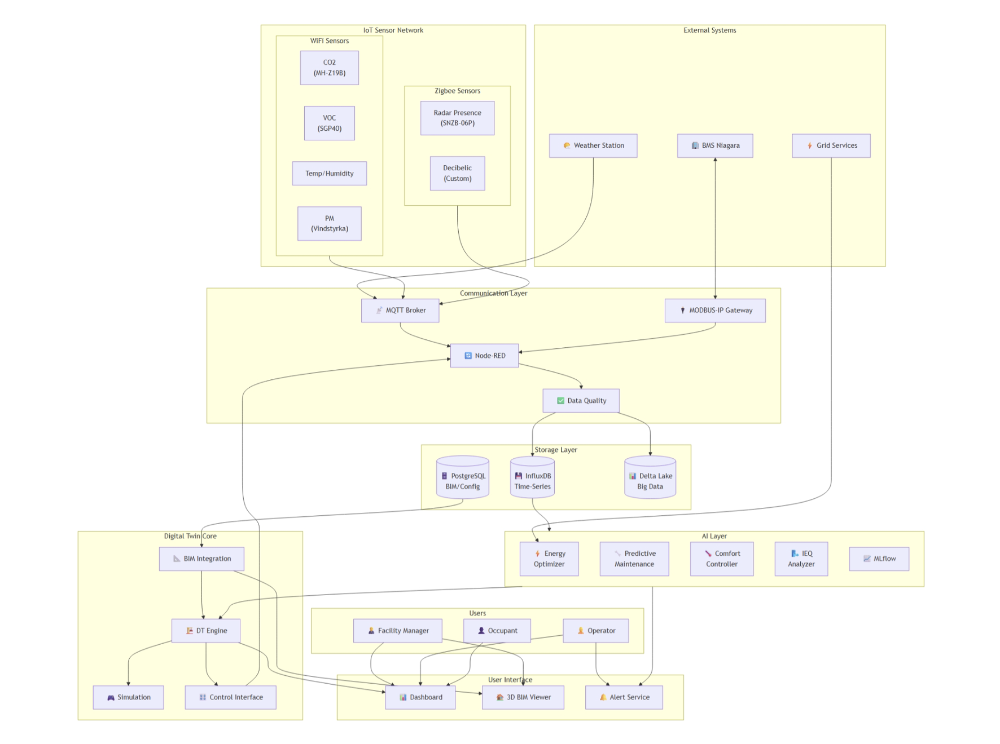
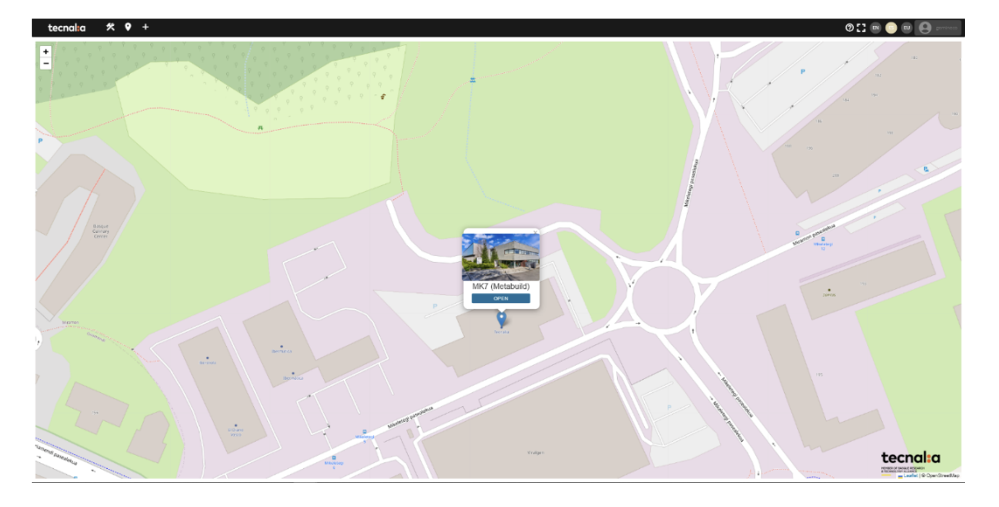
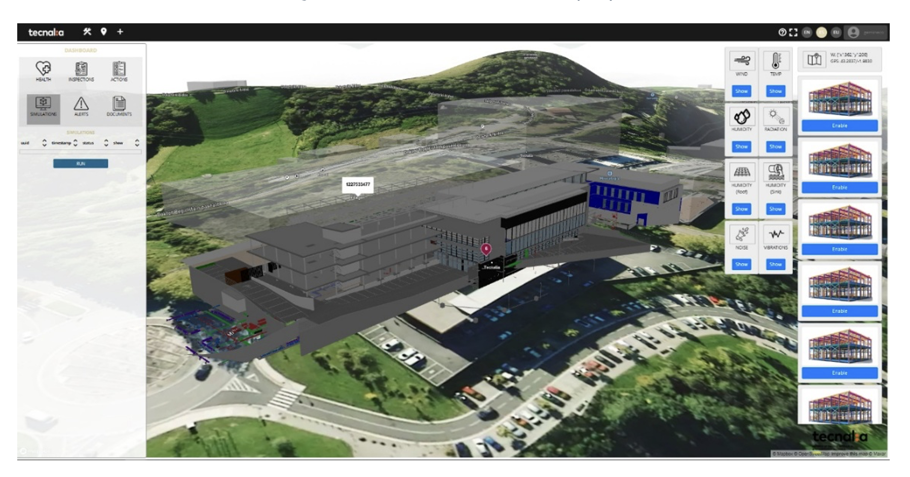
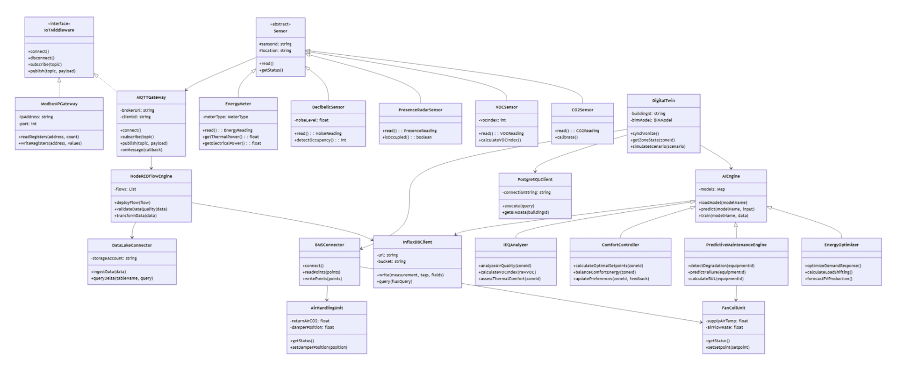

## **General Information and Purpose**

**TE ID & Name:** TE-16 - Building Digital Twins (Digital Twin for Optimised Operation, Fault Detection & Predictive Maintenance)

**Description and purpose:** TE-16 delivers a **building-level Digital Twin (DT)** supporting **optimised operation**, **real-time fault detection** and **predictive maintenance** for electrified buildings.

The service integrates **hybrid physical and data-driven models**, **advanced analytics** and **machine-learning techniques** to represent the dynamic behaviour of building systems and assets, enabling:

- continuous monitoring of operational performance
- short- and mid-term operational optimisation
- early detection and diagnosis of faults
- prediction of **Remaining Useful Lifetime (RUL)** of critical equipment

The Digital Twin acts as a **decision-support tool** for facility managers, energy managers and service operators, supporting **energy savings**, **improved reliability**, **user comfort** and **grid flexibility participation**.

An initial DT prototype was developed before pre-pilot (**D4.1**), with progressive enrichment and pilot-specific calibration in **D4.2** and **D4.3**.

**Lead partner/Contact Information:**

- Lead (TE-16): **TECNALIA**
- In collaboration with: **EDF**

**Associated Task:** **T4.6** - Digital Twin for buildings optimised operation, fault detection and predictive maintenance

**Target Deliverables:**

- **D4.1** - Initial release
- **D4.2** - Pilot-ready update
- **D4.3** - Final validated version

**Target Front Runners/Pilots:** **FR6 - Spanish pilot**

**Other possible pilots for TE scalability:**

- META-BUILD demonstration buildings where **TECNALIA** and **EDF** are involved
- Electrified buildings with monitoring infrastructure

**Architecture Diagram:**


This architecture provides a high-level view of the system components, their connections and the communication protocols used throughout the META-BUILD Digital Twin framework.

**Assets covered:**

- **Heat Pumps (HPs)**
- **PV / PVT systems and inverters**
- **Auxiliary HVAC components** (valves, pumps, controllers)
- **Sensors and meters** (temperature, power, flow, status, occupancy)

**Operational focus:**

- **Zone-level HVAC operation**
- **Building-level energy planning**
- **Equipment health and degradation**
- **Interaction between assets** (thermal-electrical coupling)

The Digital Twin operates as a **hybrid cloud-edge service** composed of the following layers:

1. **Data Ingestion Layer**
   - Inputs from sensors, BMS / EMS, asset controllers and historical databases
   - Potential integration through the **TE-10 interoperability layer**

2. **Hybrid Modelling Layer**
   - **Physical models** (Modelica-based representations)
   - **Data-driven models** (e.g. RC, ARX)
   - **Metamodels** for diagnosis and prognosis

3. **Analytics & Intelligence Layer**
   - Energy-use planning based on forecasting
   - Operational optimisation algorithms
   - Fault detection and diagnosis (**FDD**)
   - Reinforcement learning-based policy refinement

4. **Service Exposure Layer**
   - APIs for dashboards
   - DT visualisation
   - Alerts
   - Integration with other WP4 services such as **T4.4** and **T4.5**

## **Functional Requirements**

Describe the core capabilities of the TE and the functions it provides.  
Focus on what the TE does, not how it is implemented.

- **Digital Twin Representation:** Provide dynamic simulation of building energy behaviour and system interactions, synchronised with real operational data and advanced module outputs.
- **Energy Use Planning:** Support daily and weekly energy-use planning, recommend load shifting and prioritisation strategies, and evaluate scenarios under different tariffs, weather and demand profiles.
- **Optimised Operation:** Analyse building occupancy profiles and preferences, evaluate thermal comfort and IAQ, and support automated HVAC control based on multi-objective optimisation of comfort, IAQ and energy consumption.
- **Predictive Maintenance & Fault Detection:** Identify faulty components and fault types, detect abnormal behaviour and deviations from expected performance, trigger early warnings and support maintenance prioritisation.
- **Decision Support:** Provide interpretable indicators, alerts and recommendations, enable what-if analysis and mid-term planning, and support advanced HVAC operational logics.
- **Hybrid Analytics Integration:** Combine physical, data-driven and AI-based methods for building-level monitoring, planning and operational optimisation.
- **Cross-Service Support:** Produce outputs that can feed optimisation, maintenance and flexibility-related services within the WP4 stack.

## **Non-Functional Requirements**

- **Performance:**
  - Supports **near-real-time monitoring** with **minutes-level latency**
  - Supports **batch and periodic analytics** for optimisation and prognosis
  - Designed for **scalable execution** across different building and zone typologies
- **Reliability and Availability:**
  - Designed for **continuous operation** during pilot phases
  - Supports **offline analysis** using historical data
- **Security (authentication, authorisation, data encryption, data privacy):**
  - **Authentication:** Authenticated APIs for monitoring and service access
  - **Authorisation:** Role-based access control
  - **Encryption:** Secure communication using **TLS**
  - **Privacy:** No personal data processing; focus on operational and technical building data
  - **Compliance:** GDPR-compliant data handling

## **Service Interfaces**

#### **Interface Types**

- **REST APIs** for data ingestion and analytics results
- **Optional message-based interfaces** (e.g. MQTT) for events and alerts
- **Dashboard integration** for facility managers and operators

#### **Typical Outputs**

- **Fault alerts** and diagnostic reports
- **Health indicators** and degradation indices
- **Optimised operation recommendations**
- **KPIs** for energy, performance and reliability

**Potential interoperability note:** Interfaces may be exposed through standardised APIs and data models defined in **T4.1 (ED)**.

#### **API Endpoints**

For each exposed endpoint:

- Request Parameters
- Request Example
- Response Parameters
- Response Example
- Error Handling

<div class="joplin-table-wrapper"><table><tbody><tr><th><p><strong>Endpoint 1</strong></p></th><th><p><strong>Get Latest Sensor Reading</strong></p></th></tr><tr><td><p><strong>Url</strong></p></td><td><p>/api/v1/sensors/{sensorId}/latest</p></td></tr><tr><td><p><strong>Method</strong></p></td><td><p>GET</p></td></tr><tr><td><p><strong>Description</strong></p></td><td><p>Returns the latest available reading for a given sensor in the Digital Twin platform.</p></td></tr><tr><td><p><strong>Headers</strong></p></td><td><ul><li>Authorization: Bearer &lt;token&gt;</li></ul></td></tr><tr><td><p><strong>Request Parameters</strong></p></td><td><ul><li>sensorId (path, required): Sensor identifier, e.g. ieq-co2-01</li></ul></td></tr><tr><td><p><strong>Request</strong><br><strong>Example</strong></p></td><td><p>GET /api/v1/sensors/ieq-co2-01/latest</p></td></tr><tr><td><p><strong>Response Parameters</strong></p></td><td><ul><li>sensorId (string): Sensor identifier</li><li>value (float): Latest measured value</li><li>unit (string): Unit of measurement</li><li>timestamp (ISO8601): Reading timestamp</li><li>location (string): Sensor location</li></ul></td></tr><tr><td><p><strong>Response</strong><br><strong>Example</strong></p></td><td><p>Example {<br>"sensorId": "ieq-co2-01",<br>"value": 487.5,<br>"unit": "ppm",<br>"timestamp": "2026-02-04T10:32:15Z",<br>"location": "office-floor-2"<br>}</p></td></tr><tr><td><p><strong>Error Handling</strong></p></td><td><ul><li>404 Not Found: {"error":{"code":"SENSOR_NOT_FOUND","message":"Sensor does not exist"}}</li><li>503 Service Unavailable: {"error":{"code":"DATABASE_UNAVAILABLE","message":"InfluxDB unavailable"}}</li></ul></td></tr></tbody></table></div>

<div class="joplin-table-wrapper"><table><tbody><tr><th><p><strong>Endpoint 2</strong></p></th><th><p><strong>Get Sensor Time Series History</strong></p></th></tr><tr><td><p><strong>Url</strong></p></td><td><p>/api/v1/sensors/{sensorId}/history</p></td></tr><tr><td><p><strong>Method</strong></p></td><td><p>GET</p></td></tr><tr><td><p><strong>Description</strong></p></td><td><p>Returns historical time-series data for a given sensor, with optional aggregation and time windowing.</p></td></tr><tr><td><p><strong>Headers</strong></p></td><td><ul><li>Authorization: Bearer &lt;token&gt;</li></ul></td></tr><tr><td><p><strong>Request Parameters</strong></p></td><td><ul><li>sensorId (path, required): Sensor identifier</li><li>start (query, required): Start time (ISO8601 or relative, e.g. -24h)</li><li>stop (query, optional): End time (default: now)</li><li>aggregation (query, optional): mean, max, min, sum</li><li>window (query, optional): Aggregation window, e.g. 5m, 1h, 1d</li></ul></td></tr><tr><td><p><strong>Request</strong><br><strong>Example</strong></p></td><td><p>GET /api/v1/sensors/ieq-co2-01/history?start=-24h&amp;aggregation=mean&amp;window=1h</p></td></tr><tr><td><p><strong>Response Parameters</strong></p></td><td><ul><li>sensorId (string)</li><li>unit (string)</li><li>aggregation (string)</li><li>window (string)</li><li>data (array): Timestamped values</li></ul></td></tr><tr><td><p><strong>Response</strong><br><strong>Example</strong></p></td><td><p>Example {<br>"sensorId": "ieq-co2-01",<br>"unit": "ppm",<br>"aggregation": "mean",<br>"window": "1h",<br>"data": [<br>{"timestamp": "2026-02-03T11:00:00Z", "value": 425.3},<br>{"timestamp": "2026-02-03T12:00:00Z", "value": 512.8},<br>{"timestamp": "2026-02-03T13:00:00Z", "value": 498.1}<br>]<br>}</p></td></tr><tr><td><p><strong>Error Handling</strong></p></td><td><ul><li>400 Bad Request: {"error":{"code":"INVALID_TIME_RANGE","message":"Invalid time range"}}</li><li>400 Bad Request: {"error":{"code":"INVALID_AGGREGATION","message":"Unsupported function"}}</li><li>401 Unauthorized: {"error":{"code":"UNAUTHORIZED","message":"Invalid token"}}</li></ul></td></tr></tbody></table></div>

<div class="joplin-table-wrapper"><table><tbody><tr><th><p><strong>Endpoint 3</strong></p></th><th><p><strong>Get Zone IEQ Metrics</strong></p></th></tr><tr><td><p><strong>Url</strong></p></td><td><p>/api/v1/zones/{zoneId}/ieq</p></td></tr><tr><td><p><strong>Method</strong></p></td><td><p>GET</p></td></tr><tr><td><p><strong>Description</strong></p></td><td><p>Returns indoor environmental quality metrics and occupancy information for a given zone.</p></td></tr><tr><td><p><strong>Headers</strong></p></td><td><ul><li>Authorization: Bearer &lt;token&gt;</li></ul></td></tr><tr><td><p><strong>Request Parameters</strong></p></td><td><ul><li>zoneId (path, required): Zone identifier, e.g. office-floor-2</li></ul></td></tr><tr><td><p><strong>Request</strong><br><strong>Example</strong></p></td><td><p>GET /api/v1/zones/office-floor-2/ieq</p></td></tr><tr><td><p><strong>Response Parameters</strong></p></td><td><ul><li>zoneId (string)</li><li>timestamp (ISO8601)</li><li>metrics (object): Temperature, humidity, CO2, VOC index, PM2.5, noise</li><li>occupancy (object): Occupancy detection and count</li></ul></td></tr><tr><td><p><strong>Response</strong><br><strong>Example</strong></p></td><td><p>Example {<br>"zoneId": "office-floor-2",<br>"timestamp": "2026-02-04T10:35:00Z",<br>"metrics": {<br>"temperature": {"value": 22.4, "unit": "°C"},<br>"humidity": {"value": 45.2, "unit": "%"},<br>"co2": {"value": 487.5, "unit": "ppm"},<br>"voc_index": {"value": 95, "unit": "index"},<br>"pm25": {"value": 8.3, "unit": "µg/m³"},<br>"noise": {"value": 42.1, "unit": "dB"}<br>},<br>"occupancy": {"detected": true, "count": 12}<br>}</p></td></tr><tr><td><p><strong>Error Handling</strong></p></td><td><ul><li>404 Not Found: {"error":{"code":"ZONE_NOT_FOUND","message":"Zone does not exist"}}</li><li>401 Unauthorized: {"error":{"code":"UNAUTHORIZED","message":"Invalid token"}}</li></ul></td></tr></tbody></table></div>

<div class="joplin-table-wrapper"><table><tbody><tr><th><p><strong>Endpoint 4</strong></p></th><th><p><strong>Get Equipment Telemetry</strong></p></th></tr><tr><td><p><strong>Url</strong></p></td><td><p>/api/v1/equipment/{equipmentId}/telemetry</p></td></tr><tr><td><p><strong>Method</strong></p></td><td><p>GET</p></td></tr><tr><td><p><strong>Description</strong></p></td><td><p>Returns telemetry for HVAC or other building equipment over a selected time range.</p></td></tr><tr><td><p><strong>Headers</strong></p></td><td><ul><li>Authorization: Bearer &lt;token&gt;</li></ul></td></tr><tr><td><p><strong>Request Parameters</strong></p></td><td><ul><li>equipmentId (path, required): Equipment identifier, e.g. fancoil-ref-01</li><li>start (query, optional): Start time (default: -1h)</li></ul></td></tr><tr><td><p><strong>Request</strong><br><strong>Example</strong></p></td><td><p>GET /api/v1/equipment/fancoil-ref-01/telemetry?start=-6h</p></td></tr><tr><td><p><strong>Response Parameters</strong></p></td><td><ul><li>equipmentId (string)</li><li>type (string)</li><li>data (array): Timestamped telemetry records</li><li>units (object): Units for temperature, airflow and power values</li></ul></td></tr><tr><td><p><strong>Response</strong><br><strong>Example</strong></p></td><td><p>Example {<br>"equipmentId": "fancoil-ref-01",<br>"type": "fancoil",<br>"data": [{<br>"timestamp": "2026-02-04T10:30:00Z",<br>"supplyAirTemp": 28.5,<br>"returnAirTemp": 22.1,<br>"airFlowRate": 320.5,<br>"waterSupplyTemp": 45.2,<br>"waterReturnTemp": 38.7,<br>"thermalPower": 2.85,<br>"electricalPower": 0.12<br>}],<br>"units": {<br>"temperature": "°C",<br>"airFlowRate": "m³/h",<br>"thermalPower": "kW",<br>"electricalPower": "kW"<br>}<br>}</p></td></tr><tr><td><p><strong>Error Handling</strong></p></td><td><ul><li>404 Not Found: {"error":{"code":"EQUIPMENT_NOT_FOUND","message":"Equipment not found"}}</li><li>401 Unauthorized: {"error":{"code":"UNAUTHORIZED","message":"Invalid token"}}</li></ul></td></tr></tbody></table></div>

<div class="joplin-table-wrapper"><table><tbody><tr><th><p><strong>Endpoint 5</strong></p></th><th><p><strong>Get Aggregated Energy Consumption</strong></p></th></tr><tr><td><p><strong>Url</strong></p></td><td><p>/api/v1/energy/consumption</p></td></tr><tr><td><p><strong>Method</strong></p></td><td><p>GET</p></td></tr><tr><td><p><strong>Description</strong></p></td><td><p>Returns aggregated energy consumption for a selected period, with optional grouping by floor, equipment or type.</p></td></tr><tr><td><p><strong>Headers</strong></p></td><td><ul><li>Authorization: Bearer &lt;token&gt;</li></ul></td></tr><tr><td><p><strong>Request Parameters</strong></p></td><td><ul><li>start (query, required): Period start</li><li>stop (query, optional): Period end (default: now)</li><li>groupBy (query, optional): floor, equipment, type</li></ul></td></tr><tr><td><p><strong>Request</strong><br><strong>Example</strong></p></td><td><p>GET /api/v1/energy/consumption?start=-7d&amp;groupBy=floor</p></td></tr><tr><td><p><strong>Response Parameters</strong></p></td><td><ul><li>period (object): Start and end of queried period</li><li>totalConsumption (object): Total value and unit</li><li>breakdown (array): Grouped consumption entries</li></ul></td></tr><tr><td><p><strong>Response</strong><br><strong>Example</strong></p></td><td><p>Example {<br>"period": {<br>"start": "2026-01-28T00:00:00Z",<br>"stop": "2026-02-04T10:40:00Z"<br>},<br>"totalConsumption": {"value": 1245.8, "unit": "kWh"},<br>"breakdown": [<br>{"floor": "floor-1", "consumption": 412.3, "unit": "kWh"},<br>{"floor": "floor-2", "consumption": 523.1, "unit": "kWh"},<br>{"floor": "floor-3", "consumption": 310.4, "unit": "kWh"}<br>]<br>}</p></td></tr><tr><td><p><strong>Error Handling</strong></p></td><td><ul><li>400 Bad Request: {"error":{"code":"INVALID_PARAMETERS","message":"Invalid parameters"}}</li><li>401 Unauthorized: {"error":{"code":"UNAUTHORIZED","message":"Invalid token"}}</li><li>429 Too Many Requests: {"error":{"code":"RATE_LIMIT_EXCEEDED","message":"Rate limit exceeded"}}</li><li>503 Service Unavailable: {"error":{"code":"DATABASE_UNAVAILABLE","message":"Database unavailable"}}</li></ul></td></tr></tbody></table></div>

#### **General Error Response Format**

```json
{
  "error": {
    "code": "SENSOR_NOT_FOUND",
    "message": "Sensor 'ieq-co2-99' not found in database",
    "timestamp": "2026-02-04T10:45:00Z",
    "path": "/api/v1/sensors/ieq-co2-99/latest"
  }
}
```

#### **UI Mockups (if applicable)**

- **Digital Twin building view:** IFC-based georeferenced 3D building representation with integrated system layers
- **Operational dashboard:** Real-time monitoring, alarms, KPIs and equipment status
- **Analytics interface:** Fault alerts, predictive maintenance outputs, operational recommendations and energy planning indicators





## **Data Model**

- **Key entities:**
  - **Building**
  - **EnergyAsset** (HP, battery, PV, storage)
  - **Sensor / Measurement**
  - **DigitalTwinModel**
  - **FaultEvent**
  - **HealthIndicator**
  - **MaintenanceRecommendation**
  - **OperationalRecommendation**
  - **EnergyUseReport**

- **Relationships:**
  - **Buildings** contain **assets**
  - **Assets** generate **measurements**
  - The **Digital Twin** models assets and systems
  - Analytics modules produce **health**, **operational**, **planning**, **fault** and **prognosis** outputs linked to assets and zones

- **Database schema (logical):**
  - buildings: {building_id, pilot_id, geometry_ref, use_type, metadata}
  - assets: {asset_id, building_id, asset_type, location, status, metadata}
  - sensors: {sensor_id, building_id, zone_id, type, unit, location}
  - measurements: {sensor_id, asset_id, ts, value, unit, quality_flag}
  - dt_models: {model_id, building_id, model_type, calibration_version, status}
  - fault_events: {event_id, asset_id, zone_id, fault_type, severity, ts, diagnosis}
  - health_indicators: {indicator_id, asset_id, ts, indicator_type, value, trend}
  - maintenance_recommendations: {recommendation_id, asset_id, priority, severity, action, created_at}
  - operational_recommendations: {recommendation_id, building_id, zone_id, target_variable, suggested_value, rationale, created_at}
  - energy_use_reports: {report_id, building_id, period_start, period_end, kpis, generated_at}



## **Data Requirements**

Below are the **minimal data requirements** for the META-BUILD Building Digital Twin (**TE-16**), grouped by service area.

| Service Area | Req | Data Category | Data Description | Unit | Spatial Scope | Time Horizon | Best-Case Granularity | Worst-Case Granularity |
| --- | --- | --- | --- | --- | --- | --- | --- | --- |
| All | - | General Building Information | Building use, HVAC/AHU systems and compatibility metadata | m², m | Building | Static | - | - |
| Energy Use Planning | R1 | Local Energy Production | PV, PVT thermal/electrical, ST, DSHP, biomass boiler output | W / kWh | System | Historical + operational (min. 6 weeks for forecasting models) | 15 min | 1 h |
| Energy Use Planning | R2 | Thermal Demand / Consumption | Heating and cooling demand / consumption | W / kWh | Equipment | Historical + operational (min. 6 weeks) | 15 min | 1 h |
| Energy Use Planning | R3 | Electricity Demand / Consumption | Electricity demand / consumption | W / kWh | Equipment | Historical + operational (min. 6 weeks) | 15 min | 1 h |
| Energy Use Planning | R4 | Zone Temperature Setpoint | Zone / thermostat setpoints | °C | Thermostat / controlled zone | Historical + operational (min. 6 weeks) | 15 min | 1 h |
| Energy Use Planning | R5 | Indoor Temperature | Indoor air temperature | °C | Zone / microzone | Historical + operational (min. 6 weeks) | 15 min | 1 h |
| Energy Use Planning | R6 | Weather Data | Ambient temperature and solar radiation | °C, W/m² | Location | Historical + operational (min. 6 weeks) | 15 min | 1 h |
| Energy Use Planning | R7 | Weather Forecast | Forecast ambient temperature and solar radiation | °C, W/m² | Location | Forecast 1-7 days ahead | 15 min | 1 h |
| Energy Use Planning | R8 | Electricity Price Forecast | Forecast electricity price | €/MWh | Building | Forecast 1-7 days ahead | 15 min | 1 h |
| Optimised Operation | R9 | Electricity Demand / Consumption | Equipment/floor/microzone electricity use | W / kWh | Equipment / floor / microzone | Historical + operational (min. 6 weeks) | 15 min | 1 h |
| Optimised Operation | R10 | Thermal Demand / Consumption | Thermal demand at equipment or microzone level | W / kWh | Equipment / microzone | Historical + operational (min. 6 weeks) | 15 min | 1 h |
| Optimised Operation | R11 | Weather Data | Ambient temperature, RH, pressure, wind, solar radiation, PM2.5 | °C, %, Pa, km/h, W/m², ppm | Location | Historical + operational (min. 6 weeks) | 15 min | 1 h |
| Optimised Operation | R12 | Control Signals | VAV opening, zone setpoint temperature | 0-10V, °C | Control equipment | Historical + operational, must be overwritable | 15 min | 1 h |
| Optimised Operation | R13 | Supply Conditions | Supply energy / temperature / flow | kWh or °C; m³/h | Supply distribution system | Historical + operational (min. 6 weeks) | 15 min | 1 h |
| Optimised Operation | R14 | Return Conditions | Return energy / temperature / flow | kWh or °C; m³/h | Return distribution system | Historical + operational (min. 6 weeks) | 15 min | 1 h |
| Optimised Operation | R15 | Zone Setpoint Temperature | Controlled-zone setpoint | °C | Thermostat / controlled zone | Historical + operational (min. 6 weeks) | 15 min | 1 h |
| Optimised Operation | R16 | Indoor Temperature | Indoor air temperature | °C | Zone / microzone | Historical + operational (min. 6 weeks) | 15 min | 1 h |
| Optimised Operation | R17 | IEQ | CO2, PM2.5, VOCs, temperature, humidity, noise | ppm, °C, %, dB | Zone / microzone | Historical + operational (min. 6 weeks) | 15 min | 1 h |
| Optimised Operation | R18 | Presence / Movement | Occupancy-related signal | integer | Zone / microzone | Historical + operational (min. 6 weeks) | 15 min | 1 h |
| Optimised Operation | R19 | Weather Forecast | Forecast ambient temperature and solar radiation | °C, W/m² | Location | Forecast 1-7 days ahead | 15 min | 1 h |
| Predictive Maintenance | R20 | Electricity Demand / Consumption | Equipment electricity use | W / kWh | Equipment | Historical failure data + operational | 15 min | 1 h |
| Predictive Maintenance | R21 | Thermal Demand / Consumption | Equipment thermal demand | W / kWh | Equipment | Historical failure data + operational | 15 min | 1 h |
| Predictive Maintenance | R22 | Supply Conditions | Fan velocity, supply temperature, airflow, differential pressure | %, °C, m³/h, Pa | Supply distribution system | Historical failure data + operational | 15 min | 1 h |
| Predictive Maintenance | R23 | Return Conditions | Return-side operational variables | %, °C, m³/h, Pa | Distribution system | Historical failure data + operational | 15 min | 1 h |
| Predictive Maintenance | R24 | Setpoint Temperature | Terminal unit setpoint temperature | °C | Terminal unit | Historical failure data + operational | 15 min | 1 h |

## **Integration and Dependencies**

- **Internal dependencies:** Possible **TE-10 interoperability framework** for data access; **WP5 monitoring infrastructure**; WP4 optimisation and control services; **WP3**, **DSHP** and **PVT** energy data for the energy use planning module
- **External dependencies:** Physical simulation tools such as **Modelica**, ML frameworks for diagnosis and prognosis, and external APIs for weather and electricity price forecasts
- **Edge devices / interfaces and cloud integration:** Hybrid cloud-edge deployment with monitoring, analytics and control integration
- **Data space integration:** TE-16 acts as both **consumer** and **producer** of data and can exchange outputs with other WP4 services

**Integration role:**

- Provides **operational**, **health** and **fault indicators** to other WP4 services
- Can feed **optimisation**, **maintenance** and **flexibility planning** services
- Consumes real-time and historical data from BMS, IoT sensors and other pilot systems

## **Security and Privacy**

- **Data Sensitivity:** TE-16 processes operational and technical building data and does not require personal data.
- **Access Control:** Role-based access to monitoring and control capabilities.
- **Encryption:** Secure communication through authenticated APIs and TLS-protected channels.
- **Privacy:** GDPR-compliant handling of building operational data.
- **Governance:** Separation of monitoring, analytics and control interfaces to support secure deployment.

## **Current Status**

This section summarises the current maturity of TE-16 for **FR6**.

**Current status:**

- Digital Twin framework defined
- Hybrid modelling approach selected
- Initial fault diagnosis and prognosis concepts validated offline
- Early experimentation performed using pilot-like datasets and simulated scenarios
- Progressive calibration planned during **D4.2** with pilot data

**Main limitations:**

- Availability and completeness of pilot data
- Progressive deployment of monitoring infrastructure

### **DT Architecture Status**

#### **Monitoring system**

The DT architecture was already conceptualised and nearly deployed in **FR6** in previous work (**D4.1**). The current status has progressed to a **full monitoring system deployment**. Indoor environmental sensors, previously lacking in the office area, are now fully installed in FR6.

#### **BMS integration**

Significant progress has been achieved in establishing **bidirectional communication** between the DT platform and the FR6 BMS, enabling both **real-time monitoring** and **control capabilities**.

- Integration with the BMS has been implemented using the **MODBUS-IP gateway** provided by the **Tridium platform**
- The gateway translates **MODBUS RTU** frames from field devices into **TCP/IP** packets consumable by the DT communication layer
- The gateway preserves original MODBUS register mappings while providing network accessibility

The connection between the MODBUS-IP gateway and the DT communication layer was established through **Node-RED**, which acts as the main data orchestration platform.

**Node-RED functions include:**

- **Data polling** for monitored variables such as HVAC operation, indoor environmental parameters and equipment status registers
- **Event-driven updates** for real-time state changes reported by the BMS
- **Protocol translation** into standardised formats for downstream processing and storage
- **Connection management**, including reconnection handling and error logging

**Storage layer:**

- Monitoring data persists in **InfluxDB** as the main time-series database
- This supports high-performance writes, efficient time-based queries, retention policies, down-sampling and dashboard / analytics integration

**Control API:**

- A dedicated **Control API** has been developed to issue setpoint commands to the BMS
- The API abstracts MODBUS register writing behind a secure RESTful interface
- It is designed to support **AI-driven optimisation algorithms**
- The DT can use centralised information from BMS data, IoT sensors, weather forecasts, occupancy predictions and energy price signals to compute optimal setpoints and transmit them to the BMS

**Controllable variables currently include:**

- Zone setpoint temperatures
- **Variable Air Volume (VAV)** damper positions (0-10 V control signal)

The controllable areas are organised into:

- **Three virtual zones** (zones 7, 8 and 9) covering the open-office area
- **One meeting room** (zone 4)

#### **Common Data Environment (CDE)**

The **Common Data Environment** for FR6 is in an advanced development phase, with a **basic but functional integration already operational**.

Current integration includes key environmental and operational parameters sourced from the BMS through the MODBUS-IP gateway. This has enabled preliminary validation of data flows across the architecture.

**Full commissioning of the CDE is scheduled for February 2026**, including:

- Complete integration of all identified BMS data points
- Full deployment of the IoT sensor network with unified ingestion pipelines
- Validation of bidirectional monitoring and control data flows
- Performance testing under realistic operational loads

#### **DT interface status**

A comprehensive DT solution has been developed to provide an integrated, data-driven representation of the building.

- Multiple **IFC models** have been fully georeferenced and combined into a unified visualisation environment
- The DT includes a visualisation dashboard and multiple connectors for advanced operational modules
- It supports both **historical data ingestion** and **real-time sensor monitoring**
- A dedicated **alarm generation service** evaluates sensor readings against predefined operating thresholds and triggers alerts when deviations occur

Overall, the DT already provides a **centralised and scalable platform** supporting operational awareness, data-driven insights and improved efficiency, reliability and sustainability.

#### **Data ingestion status**

Operational data for advanced module development are being collected and will be used for training models in a simulation environment.

For the **energy use planning** module:

- FR6 operational data is being collected and analysed
- There is still a lack of **DSHP (TE-6)** and **PVT (TE-7)** operational data because those systems have not yet been commissioned in FR6
- Current data sources include:
  - air heater operation in laboratory space
  - power and accumulated energy supply
  - ambient temperature
  - PV generation from the current PV system
  - meteorological data from open databases or the installed weather station

It has also been observed that some key building operation parameters are not available in the current BMS. Therefore, **on-site measurements** are required to adapt modules to available data.

For example:

- Air velocity measurements will be taken in fan coil and VAV ducts
- This is needed to define the relationship between fan speed and airflow rate supplied to each virtual zone
- This is essential because only total zone energy is currently available in FR6, not energy per unit or per virtual zone

### **Pilot constraints due to commissioning delays**

The DT architecture and interface are already **pilot-ready**, but the advanced module development is facing delays due to pilot constraints.

#### **Energy Use Planning Module**

- Lack of operational data because **DSHP (TE-6)** and **PVT (TE-7)** have not yet been installed in FR6
- Causes include technical and administrative delays, repairs on the building site and building opening delays

#### **Optimised Operation Module**

- Lack of **IEQ** and **occupancy sensor data** due to delayed installation
- Causes include technical and administrative delays, need for new electrical points and digital infrastructure connection issues
- Enough IEQ data is expected to be collected during the **first term of 2026** to start model development and calibration

There is also a lack of **fan coil electric consumption data** because the relevant energy analysers were not properly commissioned. This is expected to be resolved by specialised electricians.

#### **Predictive Maintenance Module**

- There is a lack of **labelled fan coil operation data**
- Development of anomaly detection and fault diagnosis functions requires a dedicated experimental campaign to generate a labelled dataset
- Faults to be emulated include:
  - heating and cooling coil valve malfunctions
  - stuck positions at different openings
  - possible loss of tightness
  - filter clogging at multiple severity levels

**Experimental approach:**

- Filter clogging will be emulated through controlled artificial pressure drop at the FCU inlet
- Valve-related faults will be induced using dummy control signals
- Tests will be performed outside office hours to avoid occupant disruption
- Each test will run for several hours under normal and faulty conditions
- Data will be time-stamped and tagged with ground-truth fault class and severity

**Preliminary feature space includes:**

- Heating and cooling setpoints
- Zone thermostat temperature
- Temporal or contextual features
- Heating and cooling valve control signals
- Fan coil supply air temperature

This testing campaign, planned for **February**, may generate some delays.

#### **Common Data Environment**

The CDE development has also experienced delays due to:

- **Data heterogeneity** across BMS registers and IoT sensors using different protocols (Zigbee, WiFi, MQTT)
- **Legacy system integration** limitations, including low data granularity and limited metadata from the BMS
- **Network and security constraints**, requiring careful balancing between secure data access and real-time performance for control-capable interfaces

## **Next Steps**

Advanced modules are currently under development in a **simulated environment**, while predictive models are being developed and calibrated with operational data from **FR6**.

Once sufficient historical data is analysed, the models will be ready for training and the advanced modules will be tested in simulation.

**Next validation steps:**

1. **Complete commissioning of the CDE in FR6**
2. **Conduct on-site tests on fan coil units** for the optimised operation and predictive maintenance modules
3. **Understand and validate current HVAC operation** to adapt the optimised operation modules
4. **Calibrate predictive models** based on available operational data
